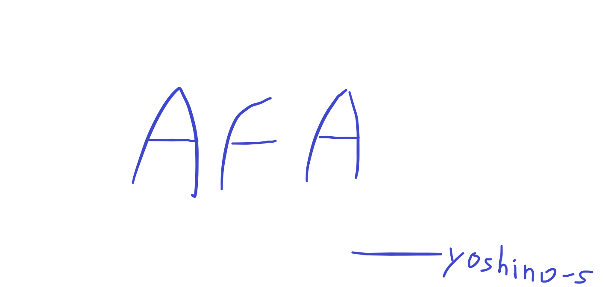

# AFA Problem Template



## 介绍

就如同这个项目的名字一样，`Auto Fuck Anheng`自动*安恒。

由于安恒傻逼的出题格式，让我每次都得花一大半的时间写格式，所以就写了个自动化工具，完成这一坨毫无意义的工作。

## 依赖

- [unoconv](https://github.com/unoconv/unoconv)，以及libreoffice/openoffice

```sh
sudo apt install unoconv libreoffice-core
pip install -r requirements.txt
```

## 用法

初始化一个题目
```sh
path/to/afa.py init problem_name
```

构建一个题目
```sh
path/to/afa.py build
```

## TODO

- 自动化测试题目exp
- 适配其他收题方